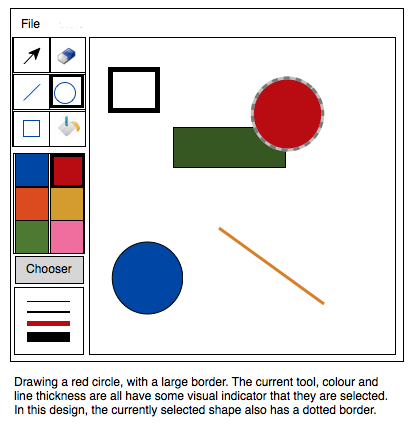

### Description
This is a rough mockup that illustrates the features that I implemented, and the basic layout.

The main area of this drawing program is a canvas that supports drawing shapes. Users can select a shape from the list on the side, specify color and border thickness, then click and drag the mouse on the canvas to draw that shape. A shape "preview" is shown as the mouse is dragged, and the shape is complete when the mouse button is released (i.e. the first click sets the starting position, and the drag operation sets the width of the circle, or creates a line, depending on the shape being drawn, and the shape is complete when the mouse button is released).
### This drawing program has the following layout and features:

+ A **menu bar** with a File menu containing the following items:
    + ** New**: create a new drawing. The drawing will always fit the canvas when it is created.
    + **Load**: load a drawing from a file (i.e. a file that you previously saved, which replaces the current drawing)
    + **Save**: save the current drawing (using a file format that you determine).
+ A **tool palette** on the left-hand side, supporting the following tools:
    + **A selection tool**: this allows the user to select a shape that has been drawn (there should be some visual indication which shape is selected). To select a shape, the user should click this tool, then click on an existing shape. Pressing ESC on the keyboard will clear shape selection. Selecting a shape will cause the color palette and line thickness palette to update their state to reflect the border colour and line thickness of that shape (e.g. if I select a circle with the largest line thickness and a red border, the color palette should change to red, and the line thickness should change to the largest line to match the selected shape). Changing color or line thickness when a shape is selected will update the border colour and thickness to the new values.
    + **An erase tool:** click on this tool and then click on a shape to delete it.
    + **A line drawing tool**: select this to draw a line (using the selected color and the line thickness).
    + **A circle drawing tool**: select this to draw an unfilled circle at the point indicated (using the selected line thickness and color for the border).
    + **A rectangle tool**: select this to draw an unfilled rectangle (using the selected line thickness and color for the border).
    + **A fill tool**: select this tool, and click on a shape to fill that shape with the currently selected color. Note that rectangles and circles have a fill color, but lines should not be fillable (i.e. this tool cannot be applied to a line).
+ **A color palette**: a graphical display of at least six colors, which the user can use to select the current color. The current drawing color will be used for any new shapes that are drawn. If a shape is already selected when a color is chosen, the shape's border will change to that new color, in the case of a circle or rectangle. In the case of a line, this will change the line colour (since lines don't have an interior fill colour). Also, there should be a Chooser button that lets the user select an arbitrary color from a color picker dialog.
+ **A line thickness palette**: a graphical display of at least three line widths that the user can select. Selecting a line width will set the border thickness for any new shapes drawn. Selecting a shape will change the border thickness to reflect the line thickness of that shape.

### This drawing program supports the following functionality as well:
+ The user is able to move a selected shape around the screen by selecting it, and dragging it with the mouse.
+ Customizable color palette: an user can wholly or partially customize color buttons in the palette (e.g. right-click a button and choose a new color for that button from a color-chooser dialog)
+ The application run at a fixed size and not be resizable.
